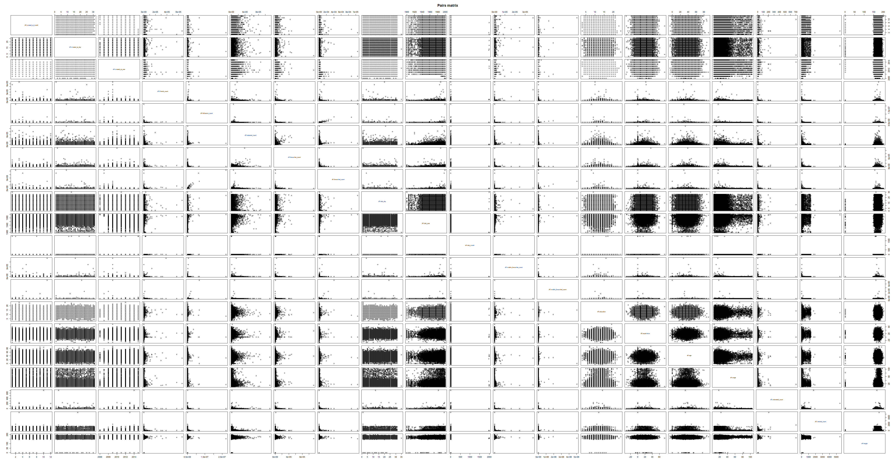

```{r setup, include=FALSE}
knitr::opts_chunk$set(echo = TRUE)
```
&nbsp;


\clearpage
\setcounter{secnumdepth}{5}
\setcounter{tocdepth}{5}
\pagebreak

# M2 Homework Assignment
R studio was configured with the following parameters before beginning the project:
```{r Configure RStudio, warning = FALSE, message = FALSE}
# clears the console in RStudio
cat("\014") 

# clears environment
rm(list = ls())  

# Set working directory
setwd("C:/R/DA5030/module_02")

# Load required packages
require(ggplot2)
```
## load the file M01_quasi_twitter.csv.   
I opened the data using read.csv2 and changed the data from integer to numeric so I could analyze it with R.

Below is my R code:
```{r open csv file}
# Some csv files are really big and take a while to open.  This command checks to
# see if it is already opened, if it is, it does not open it again.
# I also omitted the first column
if (!exists("df1")) {
  df1 <-
    read.csv2(
      'M01_quasi_twitter.csv',
      sep = ",",
      stringsAsFactors = FALSE,
      row.names = NULL,
      header = TRUE
    )
}

# Check to make sure the data is in numeric form for analysis:
sapply(df1, class)

# change int to numeric
df1[2:4] <- sapply(df1[2:4], as.numeric)
df1[7:14] <- sapply(df1[7:14], as.numeric)
df1[16:20] <- sapply(df1[16:20], as.numeric)
df1[22:25] <- sapply(df1[22:25], as.numeric)

# Confirm changes with info
str(df1)


```

##Plot Two Linear Models
To find two significant linear models, I made a new data frame with all of the numeric data and used pairs to analyze all of the data. This produces scatter plots of all of the data.  This process took a really long time, so I commented out the graphing part and attached the image below:
```{r data pairs, warning = FALSE}
df2 <-
  data.frame(
    df1$created_at_month,
    df1$created_at_day,
    df1$created_at_year,
    df1$friends_count,
    df1$followers_count,
    df1$statuses_count,
    df1$favourites_count,
    df1$favourited_count,
    df1$dob_day,
    df1$dob_year,
    df1$dob_month,
    df1$mobile_favourites_count,
    df1$mobile_favourited_count,
    df1$education,
    df1$experience,
    df1$age,
    df1$wage,
    df1$retweeted_count,
    df1$retweet_count,
    df1$height
  )
#pairs(df2, labels = colnames(df2), main = "Pairs matrix", pch = 21)
```



That, gives us plenty to look at, doesn't it?

###Model 1

Model 1 looks at the relationship between favorited count and followers count, to see if the followers count matters in the favorited count, I plotted the graph below:
```{r scatter plot 1, warning = FALSE}
p <-
  qplot(favourited_count,
        followers_count,
        data = df1,
        position = "jitter")
p + stat_smooth()
```

It looks like there is some correlation between the two so I can fit the linear model.

####Fit the Linear Model
lm is used to fit linear models. It can be used to carry out regression, single stratum analysis of variance and analysis of covariance.

To begin I need a response variable (favourited_count) and the predictor (followers_count) and then I need to save this model for further analysis:
```{r linear model 1}
# First I am going to make a data frame with this info
dfFavFol <-
  subset(df1, select = c(favourited_count, followers_count))

m_favourited_followers <-
  lm(favourited_count ~ followers_count, data = dfFavFol)
m_favourited_followers
```

Which translates in to the equations below:

$$ favorited count = 57.777272 + 0.005882 x_{followers count} + \varepsilon $$  

####P-value, t-statistic and standard error:
Below is the analysis of the linear model:
```{r linear model summary 1}
summary(m_favourited_followers) 
```
This returns significant information that the t value is significant, there is not much standard error and the small p value, the probability is very significant. This tells me that followers count matters in the favorited count.

Next I move onto an anova.

####Anova
Analysis of variance (ANOVA) is a collection of statistical models used to analyze the differences among group means and their associated procedures (such as "variation" among and between groups), developed by statistician and evolutionary biologist Ronald Fisher.

An F-test is any statistical test in which the test statistic has an F-distribution under the null hypothesis. Like a t-statistic, or a p-value it provides an estimate of whether one should accept or reject the null hypothesis. The F-test is sensitive to non-normality (as is a t-statistic) but is appropriate under the assumptions of normality and homoscedasticity.
```{r anova summary 1}
anova(m_favourited_followers) 
```
From this output, the f value is high and the p-value is less than 0.05 (which tells me the F value is significant), therefore I can reject the null hypothesis of no differences between the data (similar to the above results).

####Generating the residual plots
The error term has the following assumptions:

* Have mean zero; otherwise the forecasts will be systematically biased.
* Statistical independence of the errors (in particular, no correlation between consecutive errors in the case of time series data).
* Homoscedasticity (constant variance) of the errors.
* Normality of the error distribution.

This function will plot the graphs: Residuals vs Fitted, Residuals vs Normal, Standardized Residuals vs Fitted Values, Residuals vs Leverage:
```{r Generating the residual plots 1}
plot(m_favourited_followers) 
```
Residuals vs Fitted:
The residuals and the fitted values should be uncorrelated in a homoscedastic linear model with normally distributed errors. There should not be a dependency between the residuals and the fitted values. It's hard to tell with this plot, but there is some indication that there is some dependency.

Residuals vs Normal:
This is a Q-Q plot to check if the residuals are normal.  The ends of the plot do not look so good for this data.

Standardized Residuals vs Fitted Values:
standardized residuals means every residual plot you look at with any model is on the same standardized y-axis. This makes it easier to compare many residual plots. This process is also called studentizing (after William Sealey Gosset, who wrote under the pseudonym Student).

Residuals vs Leverage:
We use leverage to check for outliers. To understand leverage, recognize that simple linear regression fits a line that will pass through the center of your data. High-leverage points are those observations, if any, made at extreme or outlying values of the independent variables such that the lack of neighboring observations means that the fitted regression model will pass close to that particular observation.  There are some points that have a large amount of leverage and probably should be removed.

I tried removing some outliers but this did not improve the results much.
```{r Generating gg plots 1, warning = FALSE}
library(data.table)
outlierReplace = function(dataframe, cols, rows, newValue = NA) {
    if (any(rows)) {
        set(dataframe, rows, cols, newValue)
    }
}

outlierReplace(dfFavFol, "favourited_count", which(dfFavFol$favourited_count > 
    50000), NA)

outlierReplace(dfFavFol, "favourited_count", which(dfFavFol$favourited_count < 
    500), NA)

outlierReplace(dfFavFol, "followers_count", which(dfFavFol$followers_count > 
    500000), NA)

outlierReplace(dfFavFol, "followers_count", which(dfFavFol$followers_count < 
    500), NA)

```

```{r linear model 1 rerun}
# First I am going to make a data frame with this info
p <-
  qplot(favourited_count,
        followers_count,
        data = dfFavFol,
        position = "jitter")
p + stat_smooth()

m_favourited_followers <-
  lm(favourited_count ~ followers_count, data = dfFavFol)
m_favourited_followers

anova(m_favourited_followers) 

plot(m_favourited_followers) 
```


####Questions:
**1.	Is the relationship significant?**

The t value and F value are significant, there is not much standard error and the small p value (less than 0.05) tells us the probability is very significant. Therefor we can conclude that we can reject the null hypothesis and that followers count matters in the favorited count.

**2.	Are any model assumptions violated?**

Yes, it looks like all of the error term assumptions are violated.  The forecasts look to be systematically biased, it looks like there is correlation between consecutive errors in the case of time series data, there is not constant variance, and the error distribution is not normal.

**3.	Does the model make sense? Why or why not?**

No, the t, F and p values look good and should reject the null hypothesis, but when I look at the plots, the data looks like it violates all of the assumptions. I think the data needs to be 'cleaned' and re-run.

###Model 2
Model 2 looks at the relationship between friends count and followers count to see if the followers count matters in the friends count, I plotted the graph below:
```{r scatter plot 2, warning = FALSE}
p2 <-
  qplot(friends_count,
        followers_count,
        data = df1,
        position = "jitter")
p2 + stat_smooth()
```

It looks like there is some correlation between the two so I can fit the linear model.

####Fit Linear Model
I applied the same approach as I did for model 1:
```{r linear model 2}
m_friend_followers <- lm(friends_count ~ followers_count, data = df1)
m_friend_followers
```

Which translates in to the equations below:

$$ favourited count = 1040 + 0.003 x_{followers count} + \varepsilon $$  

####P-value, t-statistic and standard error:
Below is the analysis of the linear model:
```{r linear model summary 2}
summary(m_friend_followers) 
```

The t value is significant, there is not much standard error and the small p value, the probability is very significant. This tells me that followers count matters in the friends count.

Next I move onto an anova.

####Anova
Analysis of variance (ANOVA) is a collection of statistical models used to analyze the differences among group means and their associated procedures (such as "variation" among and between groups), developed by statistician and evolutionary biologist Ronald Fisher.

An F-test is any statistical test in which the test statistic has an F-distribution under the null hypothesis. Like a t-statistic, or a p-value it provides an estimate of whether one should accept or reject the null hypothesis. The F-test is sensitive to non-normality (as is a t-statistic) but is appropriate under the assumptions of normality and homoscedasticity.
```{r anova summary 2}
anova(m_friend_followers) 
```
From this output, the f value is high and the p-value is less than 0.05 (which tells me the F value is significant), therefore I can reject the null hypothesis of no differences between the data (similar to the above results).

####Generating the residual plots
The error term has the following assumptions:

* Have mean zero; otherwise the forecasts will be systematically biased.
* Statistical independence of the errors (in particular, no correlation between consecutive errors in the case of time series data).
* Homoscedasticity (constant variance) of the errors.
* Normality of the error distribution.

This function will plot the graphs: Residuals vs Fitted, Residuals vs Normal, Standardized Residuals vs Fitted Values, Residuals vs Leverage:
```{r Generating the residual plots 2}
plot(m_friend_followers) 
```
Residuals vs Fitted:
The residuals and the fitted values should be uncorrelated in a homoscedastic linear model with normally distributed errors. There should not be a dependency between the residuals and the fitted values. It's hard to tell with this plot, but there is some indication that there is some dependency.

Residuals vs Normal:
This is a Q-Q plot to check if the residuals are normal.  The ends of the plot do not look so good for this data.

Standardized Residuals vs Fitted Values:
standardized residuals means every residual plot you look at with any model is on the same standardized y-axis. This makes it easier to compare many residual plots. This process is also called studentizing (after William Sealey Gosset, who wrote under the pseudonym Student).

Residuals vs Leverage:
We use leverage to check for outliers. To understand leverage, recognize that simple linear regression fits a line that will pass through the center of your data. High-leverage points are those observations, if any, made at extreme or outlying values of the independent variables such that the lack of neighboring observations means that the fitted regression model will pass close to that particular observation.  There are some points that have a large amount of leverage and probably should be removed.

This is a more detailed version of the Residuals vs Fitted plot. This does not look uncorrelated.
```{r Generating gg plots 2, warning = FALSE}
qplot(predict(m_friend_followers), resid(m_friend_followers)) +
  geom_smooth(method = lm) + xlim(0, 5000) + ylim(0, 20000)
```

####Questions:
**1.	Is the relationship significant?**
The t value is significant, there is not much standard error and the small p value, the probability is very significant. This tells us that followers count matters in the friends count.

**2.	Are any model assumptions violated?**
Yes, it looks like all of the error term assumptions are violated.  The forecasts look to be systematically biased, it looks like there is correlation between consecutive errors in the case of time series data, there is not constant variance, and the error distribution is not normal.

**3.	Does the model make sense? Why or why not?**
No, the t, F and p values look good and should reject the null hypothesis, but when I look at the plots, the data looks like it violates all of the assumptions. I think the data needs to be 'cleaned' and re-run.

##Multivariate Linear Regression
A multivariate relation between wage & height, race, age, education, and experience:
```{r Multivariate Linear Regression}
# First I am going to make a data frame with this info
dfWage <-
  subset(df1, select = c(wage, height, race, age, education, experience))

# This is the model
m_wage_height_race_age_education_experience <-
  lm(wage ~ height + race + age + education + experience, data = dfWage)

# This is the result
m_wage_height_race_age_education_experience

# This is the summary
summary(m_wage_height_race_age_education_experience)

# This is the anova test
anova(m_wage_height_race_age_education_experience)
```

From this output, the p-value is greater than 0.05 (with an exception to height), not very small, this indicates weak evidence against the null hypothesis, so I fail to reject the null hypothesis and that there is no significant difference between specified populations.

###Multi-colinearity
Multicollinearity (also collinearity) is a phenomenon in which two or more predictor variables in a multiple regression model are highly correlated, meaning that one can be linearly predicted from the others with a non-trivial degree of accuracy.

To understand multicollinearity, I can run a correlation between the variables:
```{r Multi-colinearity}
# multicollinearity for wage and height
cor(dfWage$wage, dfWage$height)

# multicollinearity for wage and race
cor(dfWage$wage, as.numeric(dfWage$race))

# multicollinearity for wage and age
cor(dfWage$wage, dfWage$age)

# multicollinearity for wage and education
cor(dfWage$wage, dfWage$education)

# #multicollinearity for wage and experience
cor(dfWage$wage, dfWage$experience)

```
This shows that there really is not much correlation between the variables, even wage and height appears small.

###Stepwise regression
Stepwise regression means to iteratively select the best predictor (that improves the model the most), then the next best until we have no predictors that improves the model or use all of the predictors. This is also called forward stepwise selection.
```{r Stepwise regression}
beg<-lm(wage ~ height, data = dfWage) 
end<-lm(wage ~ ., data = dfWage) 
empty<-lm(wage ~ 1, data = dfWage) 
bounds<-list(upper=end,lower=empty) 
stepwise_reg<-step(beg,bounds, direction = "forward")
stepwise_reg
```
The AIC is too high for this information to be significant.  This is what I expected from the previous results.

Since the only significant data is wage and height, I am making a model of that:
```{r scatter plot 3, warning = FALSE}
p3 <-
  qplot(wage,
        height,
        data = dfWage,
        position = "jitter")
p3 + stat_smooth()
```

It looks like there is some correlation between the two so I can fit the linear model.

I applied the same approach as I did for model 1 and 2:
```{r linear model 3}
m_wage_height <- lm(wage ~ height, data = dfWage)
m_wage_height
plot(m_wage_height)
```

The plots do not look that great and the data should be cleaned a little.  This data violates all of the assumptions for the residual plots.


###Questions:
**1. Is the relationship significant?**
Height and wage is the only significant relationship, the t value is significant, there is not much standard error and the small p value, the probability is very significant. This tells us that height matters with regards to wage. Everything else is insignificant.

**2. Is there any multi-colinearity in multivariate models?**
Not really, there was no significant correlation between the variables, height was the most significant and that was only 0.14.

**3. In in multivariate models are predictor variables independent of all the other predictor variables?**
It looks like they are all independent of each other, with an exception to height.

**4. In in multivariate models rank the most significant predictor variables and exclude insignificant one from the model.**
Height is the only significant predictor.

**5. Does the model make sense? Why or why not?**
Not really, the data shows that wage and height are significant, common sense would tell us that this isn't true. In the next section I show that it is based on gender not height.

##A significant logistic linear model 
Logistic regression, or logit regression, or is a regression model where the outcome variable is categorical. Often this is used when the variable is binary (e.g. yes/no, survived/dead, pass/fail, etc.)

I am going to compare height and gender to see if I can use height to predict gender:

```{r logistic linear model part 1}
# Put data into data frame
dfGenderH <- subset(df1, select = c(gender, height))

# Remove na
dfGenderH <- na.omit(dfGenderH)

# Change male and female to 1 and 2 to evaluate.
dfGenderH$gender <-
  factor(dfGenderH$gender,
         levels = c("female", "male"),
         labels = c(1, 2))

# Plot the info
qplot(gender, height, data = dfGenderH, color = gender) + geom_boxplot() +
  xlab("gender \n1 = Female and 2 = male")
```
This shows that there is a significant difference between men and women and that I can model a significant difference between the two.

I begin by setting up a model with the gender info and the height:
```{r logistic linear model part 2}
m_gender_logistic <- lm(as.numeric(gender) ~ height, data = dfGenderH)
m_gender_logistic
summary(m_gender_logistic)
anova(m_gender_logistic)
qplot(height, as.numeric(gender), data = dfGenderH) +
  stat_smooth(method = "lm",
              formula = y ~ x,
              se = FALSE) + ylab("gender \n1 = Female and 2 = male")
```
The results are as expected that the data is different and we can use height to predict gender.  The data shows a high t value and a high F value with a very low p value, this means that I can reject the null hypothesis and that there is no significant difference between specified populations.


I think it is strange that there is a correlation between height and wage from the previous section and I think it is actually a correlation between gender and wage.  The analysis above showed that men are typically taller than women and the analysis below shows the pay gap based on gender.  I think this is the reason there is a correlation between height and wage.
```{r logistic linear model part 3}
# Put data into data frame
dfWageGender <- subset(df1, select = c(gender, wage))

# Remove na
dfWageGender <- na.omit(dfWageGender)

# Change male and female to 1 and 2 to evaluate.
dfWageGender$gender <-
  factor(dfWageGender$gender,
         levels = c("female", "male"),
         labels = c(1, 2))

# Plot the info
qplot(gender, wage, data = dfWageGender, color = gender) + geom_boxplot() +
  xlab("gender \n1 = Female and 2 = male")

```

```{r logistic linear model part 4}
m_gender_wage <- lm(as.numeric(gender) ~ wage, data = dfWageGender)
m_gender_wage
summary(m_gender_wage)
anova(m_gender_wage)
qplot(wage, as.numeric(gender), data = dfWageGender) +
  stat_smooth(method = "lm",
              formula = y ~ x,
              se = FALSE) + ylab("gender \n1 = Female and 2 = male")
```

###Questions:
**1. Is the relationship significant?**

The t value is significant, there is not much standard error and the small p value, the probability is very significant. This tells us that there is correlation between gender and height.

**2. Does the model make sense? Why or why not?**

Yes, this data makes sense. The data supports that we can reject the null hypothesis and it supports the notion that we can predict gender from height.
