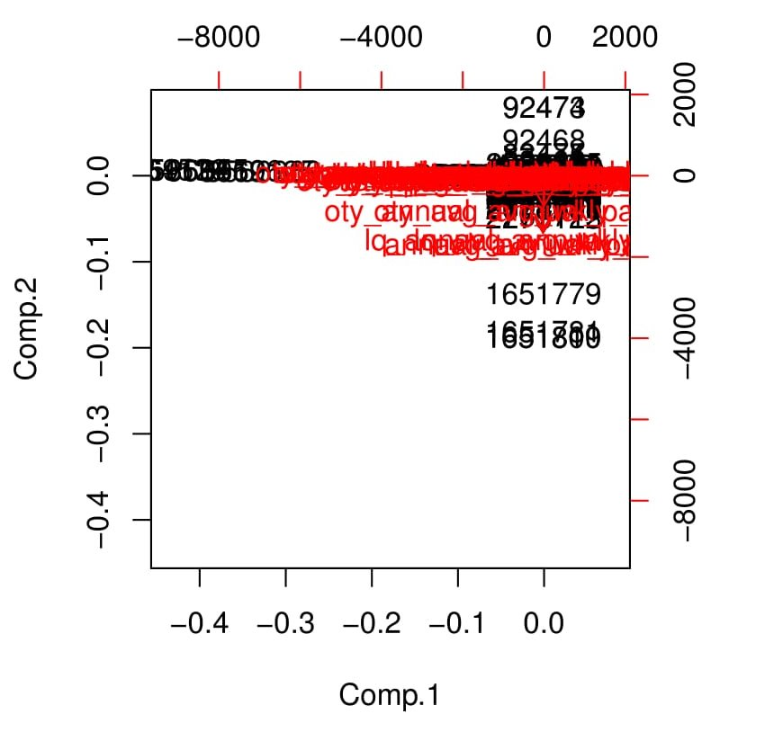
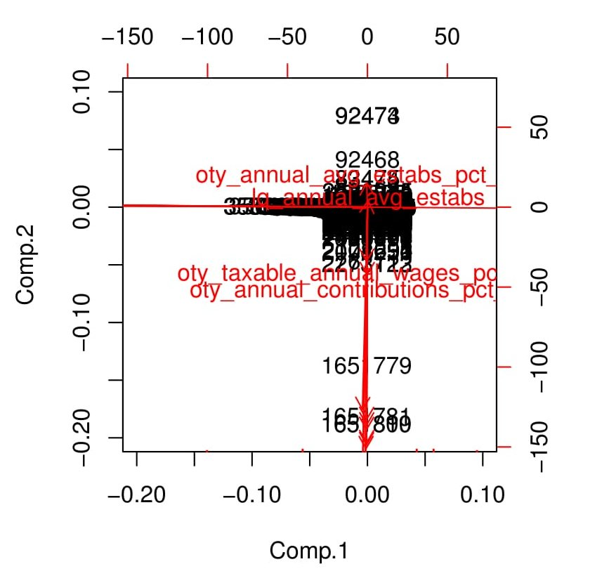

```{r setup, include=FALSE}
knitr::opts_chunk$set(echo = TRUE)
```
&nbsp;


\clearpage
\setcounter{secnumdepth}{5}
\setcounter{tocdepth}{5}
\pagebreak

# M3 Homework Assignment
R studio was configured with the following parameters before beginning the project:
```{r Configure RStudio, warning = FALSE, message = FALSE}
# clears the console in RStudio
cat("\014") 

# clears environment
rm(list = ls())  

# Load required packages
require(ggplot2)
```

## Load U.S. Bureau of Labor Statistics (BLS) Data.   
I opened the data using read.csv2, I set stringsAsFactors = FALSE so that the strings in a data frame will be treated as plain strings and not as factor variables, row names is set at null since there are no row names, headers is true since the data has headers, and I added NA strings in case there is missing data.
Below is my R code:
```{r open csv file}
# Some csv files are really big and take a while to open.  This command checks to
# see if it is already opened, if it is, it does not open it again.
# I also omitted the first column

if (!exists("dfBLS")) {
  dfBLS<-
    read.csv2(
     "2014.annual.singlefile.csv",
      sep = ",",
      stringsAsFactors = FALSE,
      row.names = NULL,
      header = TRUE,
      na.strings=c("","NA")
    )
}

# This is another way of opening the file, but it takes R a really long time to
# complete these tasks, so I have it commented out as a reference:

# if (!exists("dfBLS")) {
#   data_url <-
#     'http://www.bls.gov/cew/data/files/2014/csv/2014_annual_singlefile.zip'
#   temp <- tempfile()
#   download.file(data_url, temp)
#   dfBLS <-
#     read.csv2(
#       unz(temp, "2014.annual.singlefile.csv"),
#       sep = ",",
#       stringsAsFactors = FALSE,
#       row.names = NULL,
#       header = TRUE,
#       na.strings=c("","NA")
#     )
#   unlink(temp)
# }

```

## Run Principal Components Analysis
I ran str() to display the internal structure of the data frame below.  According to the results, there is a mixture of text, integers, and numeric data. However, for principal components analysis (PCA), R allows only numeric data to be used. 

In order to get a better understanding of how the data should be organized, I referenced the government website (https://data.bls.gov/cew/doc/access/csv_data_slices.htm) that has a description of the data.  According to the website, the Annual Average Data Slice Layout has 10 text types and 28 numeric types.  Since PCA requires numeric data, I removed all of the text types and converted everything else to numeric. The process is shown below:
```{r format data}
# Check data.
str(dfBLS)

# First, keep only data needed, this process removes only text information as
# outlined by the website, https://data.bls.gov/cew/doc/access/csv_data_slices.htm
# In this case it is easier to drop than keep:
drops <-
  c(
    "area_fips",
    "own_code",
    "industry_code",
    "agglvl_code",
    "size_code",
    "year",
    "qtr",
    "disclosure_code",
    "lq_disclosure_code",
    "oty_disclosure_code"
  )

# This is a new data frame with the test information removed.  I did this in case I
# need to access the original information again.
dfBLS2 <- dfBLS[,!(names(dfBLS) %in% drops)]

# change to numeric
dfBLS2[1:28] <- sapply(dfBLS2[1:28], as.numeric)

# Check data again
str(dfBLS2)
```

###princomp()
I will use princomp to perform PCA on this data. princomp() performs a principal components analysis on the given numeric data matrix and returns the results as an object of class princomp. 
```{r princomp}
# Save the fit to a fit object to run additional analysis later.
dfBLS2.fit.A <-
  princomp(
    formula = ~ .,
    data = dfBLS2,
    cor = TRUE,
    na.action = na.exclude
  )
```

###Extracting Components
To understand how many components should be extracted from the dfBLS2.fit, I need to run some tests such as basic analysis of the data, screeplots, and biplots.

####Analysis
Summary will give me a good understanding of what the data entails.
```{r dfBLS2.fit.A analysis}
summary(dfBLS2.fit.A)
```
The proportion of variance is telling me that 34.0% of the variance can be captured by taking the first component, 13.6% by taking the second component,...etc. The cumulative proportion is a running total of what variance can be captured, for example 34.0% with component 1, 47.6% with comp 1 and 2,...etc.  To get at least 75% of the variance, the first 6 componets are required.

####Screeplot
Screeplots plots variances against the number of the principal component.
```{r dfBLS2.fit.A screeplot}
screeplot(dfBLS2.fit.A)
```

Since the first principal component is large and there are 28 components, I scaled the principal component's by the first principal component.
```{r dfBLS2.fit.A barplot}
barplot(dfBLS2.fit.A$sdev/dfBLS2.fit.A$sdev[1])
```

####Biplots
Evidence of clustering in the data can be visualized by looking scores of the first principal component against the scores of the second, scores of the second principal component against the scores of the third, etc. These are called biplots of the principal component's. Since this R function takes a really long time to load, I commented out the function and inserted a .jpg of the results, refer to Figure 1 for the plot:
```{r dfBLS2.fit.A biplot}
#biplot(dfBLS2.fit.A)
```



It was really hard to read that plot so I zoomed in a little with this command (see Figure 2 for the plot)
```{r dfBLS2.fit.A biplot 2}
#biplot(dfBLS2.fit.A, expand=500, xlim=c(-0.20, 0.1), ylim=c(-0.2, 0.1))
```



##Questions
**1 .What proportion of the total variation in the data is explained by each of the principal components?**

34.0% of the total variance is captured by taking the first component, the second component has 13.6% of the total variance so comp 1 and 2 has then 47.6% of the total variance.  Each component has less and less variance, 95% of the total variance is contained in the first 11 of 28 components.  That means the last 17 components have less than 5% of the total variance. 

**2. What happens when you plot a screeplot?**

The scree plot visually shows the variance information for each component.  It shows that most of the variance is contained in the first set of plots and it gets low and lower for each additional component.

**3. Based on the variation explained for each of these components, which, if any, components would you use? Why?**

I would use the first 11 of 28 components, the first 11 contain 95% of the variance, anything after that is so small that I do not think it would have an effect on the analysis.

**4. Is there evidence of clustering in the data by creating biplots of the each of the components plotted against one another? Why or why not?**

The biplot looks like everything is very close together, with an exception to a couple one off points. The points look to be in between -50 and 50, and -0.05 and 0.05, I think it would be nicer if they were more spread out. For the vector points, there are too many to make sense of it all.  If I was going to do a detailed analysis, I would have to figure out a way to spread the variables out a little bit more.  Overall, I would call these data "clustered", since there are so many points in a small area.

**5. Do any of the biplots reveal any interesting structure?**

No, it looks like a blob of points in the middle of a graph. 

**6. How many pcs are required to explain 75% of the variance in the data?**

Six components are required, they would explain 77% of the variance, refer to section 1.2.2.1 Analysis, for the detailed information.
